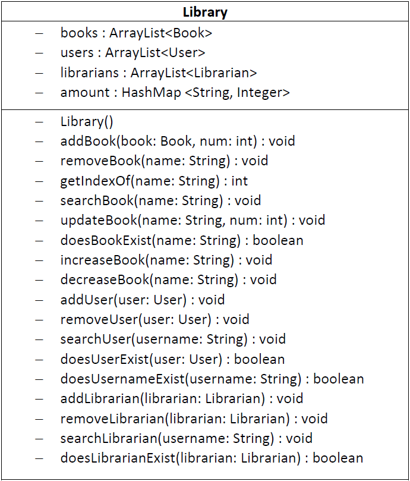
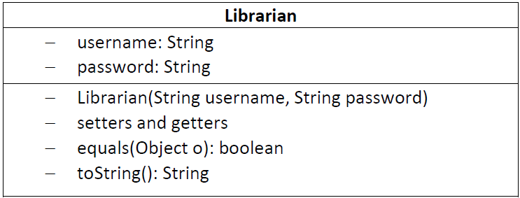
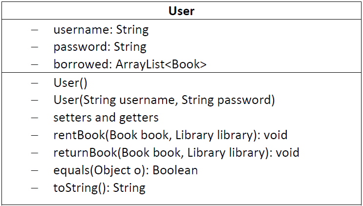
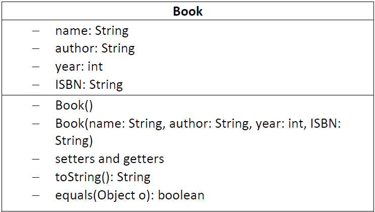

# Introduction
In this assignment we are supposed to implement a library management system using OOP. Libraries, librarians, users, and books are each initialized with their own instance variables and methods. This approach can be used for several libraries which can be accessed by the same librarian. Users can borrow available books and return only the ones they have previously borrowed.
# Design and Implementation
Both user and librarian classes have username and password as private strings that can be accessed through setter/getter methods. This approach (encapsulation) is followed in all classes. In order to always have at least one librarian, one is made at first with username and password "admin". You can log in and add more librarians. Librarian can also add, remove, search books, update the inventory of a book and add, remove, search or update a user or librarian account. There's always a logout option to terminate the program.  
If you want to enter as a user, you can either log in with a previous account or sign up a new one. Username must be unique. When the user wants to borrow a book, inventory of the book and whether they can borrow it or not is reported. Also, If they want to return a book, it should be in their list of borrowed books. All borrowed books of a user is defined in an ArrayList as an instance variable of each user. The inventory of every book is stored in a HashMap in the library class with the name of the book as the key and the number as the value. This HashMap will be updated everytime a book is borrowed or returned by a user or updated by the librarian.  
All users, books and librarians are put in a separate ArrayList in the library class.   
These UMLs visually represent the classes structures:  

       

While getting inputs, I had a problem with Scanner.nextInt() because this method does not read the newline character in the input generated by hitting "Enter," and so the call to Scanner returns after reading that newline. So I put a Scanner.nextLine() call after each Scanner.nextInt(). There is also another solution where I can read all inputs using nextLine and convert them to the proper format I need (using parseInt for integers,...).
# Conclusion
The project template is based on one or several librarians having access to one or several libraries. Since this project is based on one library and different librarians, There can be another approach where all the methods are implemented in the librarian class, so all the functions of librarians are limited to themselves. In this way library would just be a list of books which in my opinion makes more sense.  
Also, Hashmap was a useful tool while working with number of books. In addition, all "toString" and "equals" methods are overridden to have the right result in printing and comparing objects.